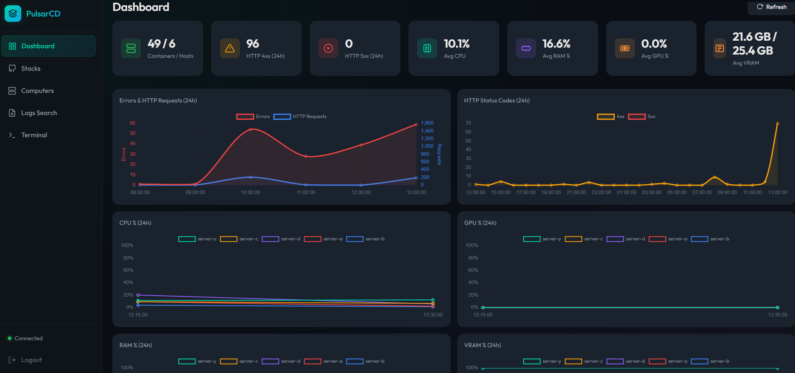
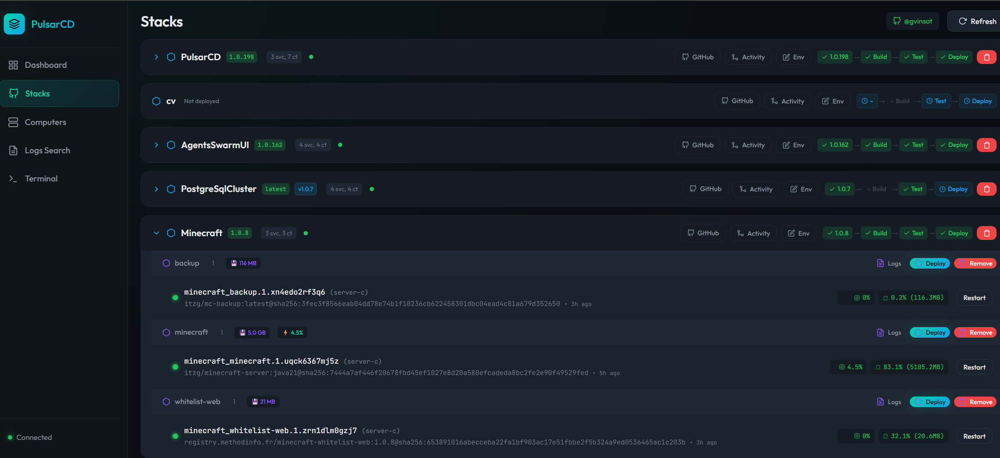
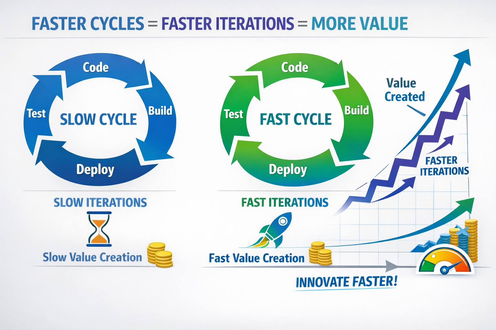

# PulsarCD

### The fastest path from code to deploy. No gates. No waiting. Just ship.


*Dashboard: Real-time metrics, error tracking, and resource monitoring*


*Stacks: Build and deploy directly from your GitHub repositories*

---

## Our Thesis

**The speed of your iteration cycle is the single most important factor in how fast you build software.**

Every minute spent waiting for a build, switching between tools, SSH-ing into a machine, or manually checking logs is a minute not spent creating. Traditional DevOps workflows are fragmented by design — GitHub over here, CI/CD over there, monitoring somewhere else, deployment in yet another tool. Each context switch kills momentum. Each manual step is a bottleneck.




We believe that compressing the cycle **commit → build → deploy → observe** into the shortest possible loop is the key to unlocking a new speed of development.

## The AI Bet

We're making a deliberate, all-in bet: **AI will very soon be reliable enough to trust with the entire software delivery pipeline.**

Today, LLMs can already search your logs in natural language, analyze error patterns, and suggest fixes. Tomorrow, they'll be able to autonomously detect a regression, roll back a deployment, and open a PR with the fix — all without human intervention.

**PulsarCD is built for that future.** Every design decision — the fully integrated architecture, the single-pane-of-glass approach, the AI-native log analysis — is made so that when AI becomes reliable enough, there are zero barriers between it and your infrastructure. No fragmented tools to bridge. No manual approval gates to bypass. Just a single, unified platform where an AI agent can observe, decide, and act.

### Honest Reality Check

Today, AI is not reliable enough to run production unsupervised. We know that. PulsarCD is already a **perfect environment for development and staging** — where the speed gains are massive and the risk is low. You get the fastest iteration cycle possible, with AI-assisted observability that makes debugging feel like having a conversation.

For production? Not yet. But the gap is closing fast. And when it does, PulsarCD will already be there — fully integrated, no assembly required.

> **TL;DR** — We're building the platform that will let AI ship your code to production. Today it accelerates your dev workflow. Tomorrow it runs the whole show.

---

## What PulsarCD Does

**One tool. One interface. Complete control.** Stop switching between GitHub, Portainer, Grafana, and terminal windows.

| Build | Deploy | Monitor | Manage |
|-------|--------|---------|--------|
| Clone from GitHub | Docker Swarm stacks | Centralized logs | Start/Stop containers |
| Multi-branch builds | Environment config | Real-time metrics | Exec into containers |
| Version tagging | Rolling updates | AI-powered search | Resource limits |
| Build history | Rollback support | Error tracking | Grouped views |

## Features

### GitHub Integration
- **Starred Repos**: Your starred repositories appear automatically
- **Branch Selection**: Build from any branch or specific commit
- **Compose Detection**: Automatically finds docker-compose files
- **Version Management**: Tag your builds with semantic versions

### Build & Deploy
- **One-Click Builds**: Build Docker images directly from your repos
- **Docker Swarm**: Deploy as Swarm stacks for high availability
- **Environment Management**: Configure environment variables per stack
- **Tag Selection**: Deploy specific versions or latest builds

### Monitoring & Logs
- **Centralized Log Collection**: Agents collect logs from all containers across all hosts
- **Full-Text Search**: Powerful OpenSearch-backed queries
- **AI-Powered Search**: Natural language queries via Ollama (e.g., "show me errors from nginx in the last hour")
- **Real-Time Metrics**: CPU, Memory, GPU (AMD/NVIDIA), Disk usage
- **Error Tracking**: 4xx/5xx HTTP error counts and trends

### Container Management
- **Multi-Host View**: See all containers grouped by host and Compose project
- **Container Actions**: Start, Stop, Restart, Pause/Unpause from the UI
- **Live Logs**: Stream container logs in real-time
- **Resource Stats**: Monitor CPU/Memory usage per container

### Dashboard
- **Summary Statistics**: Running containers, hosts, error counts at a glance
- **Time Series Charts**: Visualize resource usage and error patterns over 24h
- **HTTP Status Distribution**: Track 4xx/5xx breakdown

## Architecture

PulsarCD uses an **agent-based architecture** where lightweight agents run on each host:

```
┌─────────────────────────────────────────────────────────────────────────────┐
│                           Central Server                                    │
│  ┌─────────────┐    ┌─────────────────┐    ┌──────────────┐                 │
│  │  Frontend   │    │    FastAPI      │    │    Ollama    │                 │
│  │  (HTML/JS)  │◄──►│    Backend      │◄──►│   (AI/LLM)   │                 │
│  └─────────────┘    └────────┬────────┘    └──────────────┘                 │
│                              │                                              │
│                      ┌───────┴───────┐                                      │
│                      │   Actions     │◄──── Container actions queue         │
│                      │    Queue      │      (start, stop, exec, etc.)       │
│                      └───────┬───────┘                                      │
└──────────────────────────────┼──────────────────────────────────────────────┘
                               │ Agents poll for actions
                               ▼
┌──────────────────────────────────────────────────────────────────────────────┐
│                            OpenSearch                                        │
│                      (Logs, Metrics, Search)                                 │
└────────────────────────────────▲─────────────────────────────────────────────┘
                                 │ Direct writes
         ┌───────────────────────┼───────────────────────┐
         │                       │                       │
┌────────┴────────┐    ┌─────────┴───────┐    ┌─────────┴───────┐
│    Host 1       │    │     Host 2      │    │     Host N      │
│  ┌───────────┐  │    │  ┌───────────┐  │    │  ┌───────────┐  │
│  │   Agent   │  │    │  │   Agent   │  │    │  │   Agent   │  │
│  └─────┬─────┘  │    │  └─────┬─────┘  │    │  └─────┬─────┘  │
│        │        │    │        │        │    │        │        │
│  ┌─────▼─────┐  │    │  ┌─────▼─────┐  │    │  ┌─────▼─────┐  │
│  │  Docker   │  │    │  │  Docker   │  │    │  │  Docker   │  │
│  │ Containers│  │    │  │ Containers│  │    │  │ Containers│  │
│  └───────────┘  │    │  └───────────┘  │    │  └───────────┘  │
└─────────────────┘    └─────────────────┘    └─────────────────┘
```

### How It Works

1. **Agents** run on each host and:
   - Collect Docker container logs and metrics locally
   - Write data directly to OpenSearch (no backend bottleneck)
   - Poll the backend for actions (start, stop, restart, exec commands)
   - Execute container actions and report results

2. **Backend** serves as the coordination layer:
   - Provides REST API for the frontend
   - Manages the actions queue for agent communication
   - Integrates with Ollama for AI-powered log search
   - Handles GitHub integration for stack deployment

3. **Frontend** provides the user interface:
   - Dashboard with metrics and error trends
   - Log search with natural language support
   - Container management across all hosts
   - Stack deployment from GitHub

## Quick Start

### Prerequisites

- Docker & Docker Compose
- Docker installed on all hosts you want to monitor

### 1. Start the Central Server

```bash
git clone https://github.com/yourusername/pulsarcd.git
cd pulsarcd

# Sign-in is Google-only: create an OAuth 2.0 Web client (see
# "Signing in" under Security Hardening), then list who may get in.
export PULSARCD_AUTH__GOOGLE_CLIENT_ID=<your-client-id>.apps.googleusercontent.com
export PULSARCD_AUTH__GOOGLE_ADMINS=you@example.com

# Start backend, frontend, and OpenSearch
docker-compose up -d
```

### 2. Deploy Agents on Each Host

Agents are deployed in **global mode** across the Docker Swarm via
`devops/docker-compose.swarm.yml` — one agent runs on every node automatically.
There is no separate per-host compose file.

```bash
# From the swarm manager node
docker stack deploy -c devops/docker-compose.swarm.yml pulsarcd
```

### 3. Access the Dashboard

Open http://localhost:5000 in your browser and sign in with one of the Google
accounts you listed above. Add `http://localhost:5000` to the OAuth client's
authorised JavaScript origins or the button will not appear.

## Configuration

### Central Server Configuration

All configuration is done via **environment variables** in `docker-compose.yml`:

```yaml
environment:
  # OpenSearch connection
  - PULSARCD_OPENSEARCH__HOSTS=["http://opensearch:9200"]
  - PULSARCD_OPENSEARCH__INDEX_PREFIX=pulsarcd

  # AI/Ollama configuration (optional - for natural language search)
  - PULSARCD_AI__MODEL=llama3.2:latest
  - PULSARCD_OLLAMA_URL=http://your-ollama-server:11434

  # GitHub integration (optional - for stack deployment)
  - PULSARCD_GITHUB__TOKEN=ghp_your_token_here

  # Collector settings
  - PULSARCD_COLLECTOR__LOG_INTERVAL_SECONDS=30
  - PULSARCD_COLLECTOR__METRICS_INTERVAL_SECONDS=15
  - PULSARCD_COLLECTOR__RETENTION_DAYS=7
```

### Agent Configuration

Configure each agent via environment variables in `devops/docker-compose.swarm.yml`:

```yaml
environment:
  # Unique agent ID (defaults to hostname)
  - AGENT_AGENT_ID=${AGENT_ID:-$(hostname)}

  # Backend URL for polling actions
  - AGENT_BACKEND_URL=http://pulsarcd-backend:5000

  # OpenSearch connection (direct writes)
  - AGENT_OPENSEARCH__HOSTS=["http://opensearch:9200"]

  # Collection intervals (seconds)
  - AGENT_LOG_INTERVAL=30
  - AGENT_METRICS_INTERVAL=15
  - AGENT_ACTION_POLL_INTERVAL=2
```

### Legacy SSH Mode (Optional)

For backwards compatibility, you can still monitor remote hosts via SSH from the central server:

```yaml
environment:
  - |
    PULSARCD_HOSTS=[
      {"name": "local", "mode": "docker"},
      {"name": "server-1", "mode": "ssh", "hostname": "192.168.1.10", "username": "deploy"},
      {"name": "server-2", "mode": "ssh", "hostname": "192.168.1.11", "username": "deploy"}
    ]
volumes:
  - ~/.ssh:/root/.ssh:ro  # Mount SSH keys
```

## Development Setup

### Without Docker

```bash
# Create virtual environment
python -m venv venv
source venv/bin/activate  # Linux/macOS
# or: venv\Scripts\activate  # Windows

# Install dependencies
pip install -r requirements.txt

# Start OpenSearch (required)
# The security plugin is disabled, so this node has NO authentication at all:
# publish it on the loopback interface only, never on 0.0.0.0.
# See the Security Hardening section below.
docker run -d -p 127.0.0.1:9200:9200 -e "discovery.type=single-node" \
  -e "DISABLE_SECURITY_PLUGIN=true" \
  opensearchproject/opensearch:3.4.0

# Run the application
python -m backend.main
```

### Project Structure

```
pulsarcd/
├── backend/
│   ├── __init__.py
│   ├── api.py              # FastAPI REST endpoints
│   ├── actions_queue.py    # In-memory queue for agent actions
│   ├── ai_service.py       # Ollama integration for NL queries
│   ├── collector.py        # Legacy log/metrics collection service
│   ├── config.py           # Configuration management (env vars)
│   ├── docker_client.py    # Docker API client
│   ├── github_service.py   # GitHub integration for stack deployment
│   ├── host_client.py      # Unified host client interface
│   ├── main.py             # Application entry point
│   ├── models.py           # Pydantic data models
│   ├── opensearch_client.py # OpenSearch operations
│   ├── ssh_client.py       # SSH client for remote hosts (legacy)
│   └── utils.py            # Utility functions
├── agent/
│   ├── __init__.py
│   ├── action_poller.py    # Polls backend for container actions
│   ├── config.py           # Agent configuration
│   ├── docker_collector.py # Local Docker log/metrics collection
│   ├── main.py             # Agent entry point
│   ├── opensearch_writer.py # Direct OpenSearch writes
│   ├── requirements.txt    # Agent-specific dependencies
│   └── utils.py            # Agent utility functions
├── frontend/
│   ├── index.html          # Main HTML page
│   └── static/
│       ├── css/
│       │   └── style.css   # Styles (Deep Ocean theme)
│       └── js/
│           └── app.js      # Frontend JavaScript
├── devops/
│   └── docker-compose.swarm.yml  # Docker Swarm deployment (backend + agents, global)
├── docker-compose.yml          # Central server deployment (dev/single host)
├── Dockerfile                  # Backend/Frontend container
├── Dockerfile.agent            # Agent container
├── requirements.txt
└── README.md
```

## API Reference

### Dashboard

| Endpoint | Method | Description |
|----------|--------|-------------|
| `/api/dashboard/stats` | GET | Get summary statistics |
| `/api/dashboard/errors-timeseries` | GET | Error count over time |
| `/api/dashboard/http-4xx-timeseries` | GET | HTTP 4xx count over time |
| `/api/dashboard/http-5xx-timeseries` | GET | HTTP 5xx count over time |
| `/api/dashboard/cpu-timeseries` | GET | CPU usage over time |
| `/api/dashboard/memory-timeseries` | GET | Memory usage over time |

### Containers

| Endpoint | Method | Description |
|----------|--------|-------------|
| `/api/containers` | GET | List all containers |
| `/api/containers/grouped` | GET | List containers grouped by host/project |
| `/api/containers/{host}/{id}/stats` | GET | Get container stats |
| `/api/containers/{host}/{id}/logs` | GET | Get container logs |
| `/api/containers/{host}/{id}/env` | GET | Get container environment variables |
| `/api/containers/action` | POST | Execute container action |

### Logs Search

| Endpoint | Method | Description |
|----------|--------|-------------|
| `/api/logs/search` | POST | Search logs with filters |
| `/api/logs/search` | GET | Search logs (query params) |
| `/api/logs/ai-search` | POST | Natural language log search (via Ollama) |
| `/api/logs/ai-analyze` | POST | AI-powered log analysis |

### AI Integration

| Endpoint | Method | Description |
|----------|--------|-------------|
| `/api/ai/status` | GET | Check Ollama connectivity and model status |

### Agent Communication

| Endpoint | Method | Description |
|----------|--------|-------------|
| `/api/agents` | GET | List connected agents and their status |
| `/api/agent/actions` | GET | Poll for pending actions (used by agents) |
| `/api/agent/result` | POST | Report action result (used by agents) |
| `/api/agent/action` | POST | Queue an action for an agent |

### Stack Deployment (GitHub Integration)

| Endpoint | Method | Description |
|----------|--------|-------------|
| `/api/stacks/status` | GET | Get deployment status |
| `/api/stacks/repos` | GET | List starred GitHub repos with compose files |
| `/api/stacks/build` | POST | Build a stack from a repo |
| `/api/stacks/deploy` | POST | Deploy a stack |
| `/api/stacks/{stack_name}/remove` | POST | Remove a deployed stack |
| `/api/stacks/{repo_name}/env` | GET | Get stack environment config |
| `/api/stacks/{repo_name}/env` | PUT | Update stack environment config |
| `/api/stacks/deployed-tags` | GET | Get deployed image tags |

#### Search Query Parameters

```json
{
  "query": "error AND timeout",
  "hosts": ["server-1"],
  "containers": ["nginx", "api"],
  "compose_projects": ["webapp"],
  "levels": ["ERROR", "WARN"],
  "http_status_min": 400,
  "http_status_max": 599,
  "start_time": "2024-01-15T00:00:00Z",
  "end_time": "2024-01-16T00:00:00Z",
  "size": 100,
  "from": 0,
  "sort_order": "desc"
}
```

### Hosts

| Endpoint | Method | Description |
|----------|--------|-------------|
| `/api/hosts` | GET | List configured hosts |
| `/api/health` | GET | Health check |

## Environment Variables Reference

### Backend (Central Server) Settings

All backend configuration is done via environment variables prefixed with `PULSARCD_`.

#### Core Settings

| Variable | Description | Default |
|----------|-------------|---------|
| `PULSARCD_DEBUG` | Enable debug mode | `false` |
| `PULSARCD_HOSTS` | JSON array of host configs (for legacy SSH mode) | `[]` |

#### OpenSearch Settings

| Variable | Description | Default |
|----------|-------------|---------|
| `PULSARCD_OPENSEARCH__HOSTS` | JSON array of OpenSearch URLs | `["http://localhost:9200"]` |
| `PULSARCD_OPENSEARCH__INDEX_PREFIX` | Index prefix | `pulsarcd` |
| `PULSARCD_OPENSEARCH__USERNAME` | Username (optional) | - |
| `PULSARCD_OPENSEARCH__PASSWORD` | Password (optional) | - |

#### AI Settings

| Variable | Description | Default |
|----------|-------------|---------|
| `PULSARCD_AI__MODEL` | Ollama model name | `llama3.2:latest` |
| `PULSARCD_OLLAMA_URL` | Ollama API URL | - |

#### GitHub Settings

| Variable | Description | Default |
|----------|-------------|---------|
| `PULSARCD_GITHUB__TOKEN` | GitHub personal access token | - |

#### Collector Settings (Legacy)

| Variable | Description | Default |
|----------|-------------|---------|
| `PULSARCD_COLLECTOR__LOG_INTERVAL_SECONDS` | Log collection interval | `30` |
| `PULSARCD_COLLECTOR__METRICS_INTERVAL_SECONDS` | Metrics collection interval | `15` |
| `PULSARCD_COLLECTOR__LOG_LINES_PER_FETCH` | Lines per container per fetch | `500` |
| `PULSARCD_COLLECTOR__RETENTION_DAYS` | Data retention period | `7` |

### Agent Settings

All agent configuration is done via environment variables prefixed with `AGENT_`.

| Variable | Description | Default |
|----------|-------------|---------|
| `AGENT_AGENT_ID` | Unique identifier for this agent | hostname |
| `AGENT_BACKEND_URL` | URL of the PulsarCD backend | `http://pulsarcd-backend:8000` |
| `AGENT_DOCKER_URL` | Docker socket URL | `unix:///var/run/docker.sock` |
| `AGENT_LOG_INTERVAL` | Log collection interval (seconds) | `30` |
| `AGENT_METRICS_INTERVAL` | Metrics collection interval (seconds) | `15` |
| `AGENT_ACTION_POLL_INTERVAL` | Action polling interval (seconds) | `2` |
| `AGENT_OPENSEARCH__HOSTS` | JSON array of OpenSearch URLs | `["http://opensearch:9200"]` |
| `AGENT_OPENSEARCH__INDEX_PREFIX` | Index prefix | `pulsarcd` |
| `AGENT_LOG_LEVEL` | Logging level (DEBUG, INFO, WARNING, ERROR) | `WARNING` |

### Legacy Host Configuration Options

Each host in `PULSARCD_HOSTS` supports these fields (for SSH mode):

| Field | Description | Required |
|-------|-------------|----------|
| `name` | Display name for the host | Yes |
| `mode` | Connection mode: `docker`, `ssh`, or `local` | Yes |
| `hostname` | IP or hostname (for SSH mode) | For SSH |
| `port` | SSH port | No (default: 22) |
| `username` | SSH username | For SSH |
| `docker_url` | Docker API URL (for docker mode) | No |
| `swarm_manager` | Is this a Swarm manager? | No |
| `swarm_routing` | Route commands through manager | No |
| `swarm_autodiscover` | Auto-discover Swarm nodes | No |

## Security Hardening

### Signing in: Google accounts on an allowlist

Everyone signs in with Google. A verified Google identity only says *who* someone
is; an allowlist of addresses decides *whether* they get in, and with which role.
An address that is not on the list is refused even with a perfectly valid Google
account — the deployment is normally published on the public internet, where
"has a Google account" is not an access rule.

**Setting up the OAuth client** (once, at
[console.cloud.google.com](https://console.cloud.google.com)):

1. *APIs & Services ▸ OAuth consent screen*: choose **Internal** if every
   address belongs to your Workspace, **External** otherwise.
2. *Credentials ▸ Create credentials ▸ OAuth client ID ▸ Web application*.
3. *Authorised JavaScript origins*: the deployment's origin, e.g.
   `https://logs.example.com` (origin only, no path). No redirect URI is needed:
   the browser posts the ID token straight to the backend.
4. Copy the **Client ID** into `PULSARCD_AUTH__GOOGLE_CLIENT_ID`. It is a public
   identifier, not a secret — the browser has to hand it to Google.

**Who gets in:**

| Variable | Effect |
|----------|--------|
| `PULSARCD_AUTH__GOOGLE_CLIENT_ID` | The OAuth Web client id. Unset disables Google sign-in entirely. |
| `PULSARCD_AUTH__GOOGLE_ADMINS` | Comma-separated addresses granted the **admin** role (deploy, shell, secrets). Set at least one, or nobody can administer the deployment through Google. |
| `PULSARCD_AUTH__GOOGLE_VIEWERS` | Comma-separated addresses granted the read-only **viewer** role. |

Both lists also accept a JSON array. They are **reapplied on every boot** and
take precedence over the UI, so addresses that come from them show up in
*Settings ▸ Users* as read-only (`from environment`) — editing one there would be
undone by the next restart. Everything added from the UI is persisted alongside
them in `/data/allowed_emails.json`, so onboarding a colleague does not need a
redeploy. Removing an address ends its open sessions immediately.

The backend verifies each Google ID token against Google's published signing
keys before looking at the allowlist: RS256 pinned (the token header picks the
key, never the algorithm), `aud` equal to the configured client id — without it,
an ID token issued to any application in the world would be accepted — `iss`
equal to Google, current `exp`/`iat`, and `email_verified` true.

### Break-glass administrator (optional)

A single local username/password account, kept as a way back in when Google is
unreachable or the OAuth client is misconfigured. It exists only when an
operator provisions it explicitly:

| Variable | Effect |
|----------|--------|
| `PULSARCD_AUTH__USERNAME` | Local username (default `admin`). |
| `PULSARCD_AUTH__PASSWORD` | At least 12 characters, no known placeholder. **Empty means no local account at all** and `POST /api/auth/login` answers 403 — nothing to guess, nothing to stuff. A weak value is refused the same way rather than replaced by a generated one: on a Google-first deployment, a random password printed once into the container logs is a live admin account nobody will ever read. |

The environment is authoritative on every boot: changing the password rotates it
and cuts the sessions it had opened, clearing it deletes the account. The sign-in
screen only offers the password form when such an account exists, behind a
"Sign in with a password instead" link.

### Required secrets

`devops/docker-compose.swarm.yml` refuses to deploy when any of these is unset
or empty (strict `${VAR:?...}` form). Generate each one with
`openssl rand -base64 32` and store them in `devops/.env`:

| Variable | Why it is mandatory |
|----------|---------------------|
| `PULSARCD_AUTH__JWT_SECRET` | Signs session tokens - the strongest credential in the stack: forging a token bypasses Google sign-in, the allowlist and the role policy at once. Minimum 32 characters; the backend **refuses to start** on a shorter or placeholder value. If left empty it generates a new secret at every restart: sessions are invalidated and replicas reject each other's tokens. |
| `PULSARCD_AUTH__AGENT_KEY` | Shared key agents use to authenticate against the backend API. Must be identical on the backend and on every agent, otherwise agents would run unauthenticated. Same 32-character minimum. |

`PULSARCD_AUTH__GOOGLE_CLIENT_ID` and `PULSARCD_AUTH__GOOGLE_ADMINS` use the same
strict form — not because they are secret, but because a stack deployed without
them is one nobody can sign in to.

**Upgrading an existing deployment:** `devops/.env` predates
`PULSARCD_AUTH__JWT_SECRET` and the two Google variables, and the compose file
uses the strict `${VAR:?}` form for all three, so the next `docker stack deploy`
fails until they are added. Set a real JWT secret rather than restoring a default.
Local accounts in `/data/users.json` other than the break-glass one are dropped on
the first boot after the upgrade: list those people in
`PULSARCD_AUTH__GOOGLE_ADMINS` / `_VIEWERS` by their Google address first, or add
them from *Settings ▸ Users* once you are signed in. Everyone is signed out once,
which is expected.

### Optional security variables

| Variable | Default | Effect |
|----------|---------|--------|
| `PULSARCD_AUTH__AGENT_KEYS` | *(empty)* | JSON object `{"<agent id>": "<key>"}`. When set, a key is only accepted for the agent it was issued to, so one compromised agent cannot poll or answer for another. The Swarm agent service uses `AGENT_AGENT_ID={{.Node.Hostname}}`, so keys are indexed by node hostname - and it currently distributes a single shared `AGENT_AUTH_KEY` to every node, so enabling this **requires** giving each node its own key (a per-node Docker secret, or one agent service per node) or every agent stops reporting. |
| `PULSARCD_TRUST_PROXY_HEADERS` | `false` (`true` in the Swarm stack) | Read the client address from `X-Forwarded-For` / `X-Real-IP` for the login rate limit. Only enable it behind a proxy that **overwrites** those headers (Traefik `forwardedHeaders.trustedIPs`); reachable directly, the header is client-controlled and lets an attacker choose their own bucket. Without it, every request behind a proxy shares a single bucket. |
| `PULSARCD_SSH_KNOWN_HOSTS` | `~/.ssh/known_hosts` | known_hosts file used for hosts that do not set `ssh_known_hosts_path`. The container bind-mounts `~/.ssh` read-only, so the stack points this at `/data/known_hosts` on the read/write volume. |
| `PULSARCD_SSH_ACCEPT_NEW_HOSTKEYS` | `false` | Trust-on-first-use, for hosts that have **no** explicit `ssh_known_hosts_path` only (a host with one stays strictly verified whatever this says - give that host `ssh_known_hosts_path="accept-new"` instead). |

### Login rate limiting and session revocation

- Failed sign-ins are counted per (identity, client address) - 5 per minute - and
  per client address - 30 per minute, on Google sign-in and password sign-in
  alike. The pairing matters: a counter keyed on the account alone would let
  anyone lock an administrator out with five bad attempts a minute, correct
  credential included.
- Changing an address's role or removing it from the allowlist bumps its
  `token_epoch` in `/data/allowed_emails.json`; rotating the break-glass password
  does the same in `/data/users.json`. Either immediately invalidates every JWT
  already issued for that identity - on the HTTP API, on the terminal WebSocket
  **and** on both MCP mounts.

### SSH host key verification

Verification is strict: a host with no matching `known_hosts` entry aborts the
connection instead of trusting whatever key the network offers. Bootstrap each
host once, **from inside the container** (the `dockerhost` alias is a host-gateway
alias and can never appear in the node's own `known_hosts`), after checking the
fingerprint out of band:

```bash
docker exec $(docker ps -qf name=pulsarcd_swarm-manager) \
  sh -c 'ssh-keyscan -p 22 dockerhost >> /data/known_hosts'
```

### Viewer role

`viewer` is read-only, enforced centrally in `auth_middleware` rather than in each
handler, so a route added later is protected by default:

- every mutating method (`POST`/`PUT`/`DELETE`/`PATCH`) under `/api/` is admin-only,
  except an explicit allowlist of POSTs that only carry a JSON query body
  (`/api/logs/search`, `/api/logs/ai-search`, `/api/logs/similar-count`,
  `/api/logs/ai-analyze`);
- everything under `/api/admin/` is admin-only;
- a few GETs are admin-only because they disclose secrets or infrastructure:
  `/api/config`, `/api/config/test`, the `.env` routes,
  `/api/stacks/test-permissions/...` and `/api/github/check-access`.
  `GET /api/hosts` returns only host names to a viewer, and the full
  hostname/port/username triple to an admin;
- the MCP actions server (`/ai/actions/mcp`) requires `role == "admin"`.

Adding a POST to the read-only allowlist means asserting it triggers no side effect
at all - no background job, no LLM agent run, no remote command.

### Deployment recommendations

- **Never expose OpenSearch.** It runs with `DISABLE_SECURITY_PLUGIN=true`, i.e.
  no authentication at all. In development `docker-compose.yml` publishes it on
  `127.0.0.1` only; in Swarm it stays on the `internal` overlay, which is
  declared `attachable: false` so no ad-hoc container can join it and read,
  alter or delete the log indices.
  **On a cluster deployed before that flag existed it has no effect yet.**
  `docker stack deploy` never reconciles the options of an existing network and
  Docker cannot flip `attachable` on a live overlay, so the network has to be
  recreated once:
  ```bash
  docker stack rm pulsarcd
  # wait for the tasks to actually disappear, then:
  docker network rm pulsarcd_internal
  docker stack deploy -c devops/docker-compose.swarm.yml pulsarcd
  # verify:
  docker network inspect pulsarcd_internal -f '{{.Attachable}}'   # -> false
  ```
- **Treat the backend as a root-equivalent service.** It mounts
  `/var/run/docker.sock` (the `:ro` flag protects the socket file, not the
  Docker API behind it) and the host SSH keys, and runs as `root` because the
  image has no docker group. Reduce that surface with `group_add: ["<docker
  GID>"]` on the non-root `appuser`, or by putting a `docker-socket-proxy` with
  an endpoint whitelist in front of the socket.
- **Keep the hardening flags.** Backend and agent both run with
  `cap_drop: [ALL]` and `security_opt: [no-new-privileges:true]`; the agent adds
  a read-only rootfs. Do not relax these to work around a permission error
  without checking what actually needs the capability.
- **Scope the mounted SSH key.** `SSH_KEYS_PATH` is mounted read-only but grants
  access to every host it can reach — use a dedicated deploy key with a
  restricted `authorized_keys` command rather than a personal key.
- **Terminate TLS at Traefik** and keep the HTTP router redirecting to HTTPS
  (already configured in the stack file).

## Troubleshooting

### Agent Not Connecting

1. Check that the agent can reach the backend:
   ```bash
   docker exec pulsarcd-agent curl http://your-backend:5000/api/health
   ```

2. Check agent logs:
   ```bash
   docker logs pulsarcd-agent
   ```

3. Verify the agent is registered:
   ```bash
   curl http://localhost:5000/api/agents
   ```

### OpenSearch Connection Issues

1. Verify OpenSearch is running:
   ```bash
   curl http://localhost:9200
   ```

2. Check logs:
   ```bash
   docker-compose logs opensearch
   ```

3. Check agent OpenSearch connectivity:
   ```bash
   docker exec pulsarcd-agent curl http://opensearch:9200
   ```

### No Logs Appearing

1. Check agent logs for collection errors:
   ```bash
   docker logs pulsarcd-agent
   ```

2. Verify containers are running on the host:
   ```bash
   docker ps
   ```

3. Check OpenSearch indices:
   ```bash
   curl http://localhost:9200/_cat/indices?v
   ```

### AI Search Not Working

1. Check Ollama connectivity:
   ```bash
   curl http://localhost:5000/api/ai/status
   ```

2. Verify Ollama URL is configured:
   ```bash
   docker-compose logs pulsarcd | grep -i ollama
   ```

### SSH Mode Issues (Legacy)

1. Ensure SSH key-based authentication is configured:
   ```bash
   ssh-copy-id user@hostname
   ```

2. Test SSH connection manually:
   ```bash
   ssh -i ~/.ssh/your_key user@hostname "docker ps"
   ```

3. Check SSH key permissions:
   ```bash
   chmod 600 ~/.ssh/your_key
   ```

## Contributing

Contributions are welcome! Please feel free to submit a Pull Request.

## License

This project is licensed under the MIT License - see the [LICENSE.md](LICENSE.md) file for details.